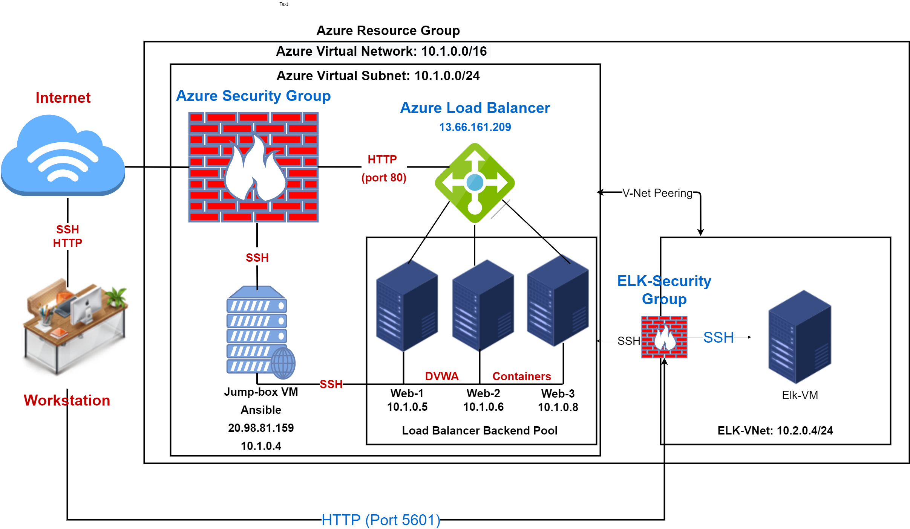
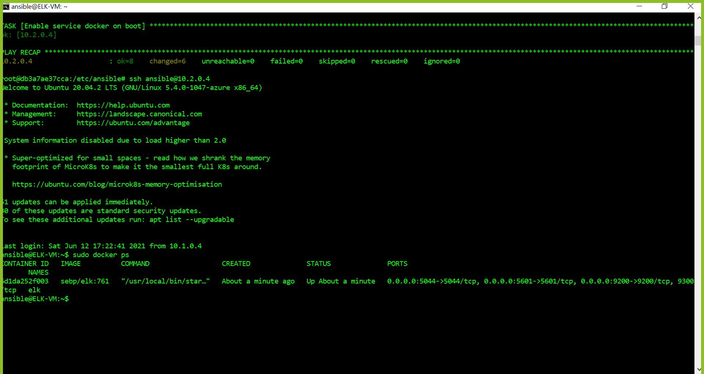

## Automated ELK Stack Deployment

The files in this repository were used to configure the network depicted below.

These files have been tested and used to generate a live ELK deployment on Azure. They can be used to either recreate the entire deployment pictured above. Alternatively, select portions of the `yaml` file may be used to install only certain pieces of it, such as Filebeat.

  - [ansible.yml](Ansible/ansible.yml)
  - [elk-install.yml](Ansible/elk-install.yml)

This document contains the following details:
- Description of the Topology
- Access Policies
- ELK Configuration
  - Beats in Use
  - Machines Being Monitored
- How to Use the Ansible Build

### Description of the Topology

The main purpose of this network is to expose a load-balanced and monitored instance of DVWA, the D*mn Vulnerable Web Application.

Load balancing ensures that the application will be highly `available`, in addition to restricting `access` to the network.
- _ What aspect of security do load balancers protect? `availability`. What is the advantage of a jump box? `increase security of the backend of the servers and reduce the attack vector surface`.

Integrating an ELK server allows users to easily monitor the vulnerable VMs for changes to the `configuration settings` and system `logs`.
- _ What does Filebeat watch for? `Filebeat watches for SSH log-ins, SUDO commands and Linux account log-ins`.
- _ What does Metricbeat record? `Metricbeat watches for CPU, RAM & monitor usage`.

The configuration details of each machine may be found below.
_Note: Use the [Markdown Table Generator](http://www.tablesgenerator.com/markdown_tables) to add/remove values from the table_.

| Name     | Function | IP Address | Operating System |
|----------|----------|------------|------------------|
| Jump Box | Gateway  |10.1.0.4    | Linux            |
| Web-1    |Webserver |10.1.0.5    | Linux            |
| Web-2    |Webserver |10.1.0.6    | Linux            |
| Web-3    |Webserver |10.1.0.8    | Linux            |
| Elk      |Elk Stack Server |10.2.0.4    | Linux            |

### Access Policies

The machines on the internal network are not exposed to the public Internet. 

Only the `jump-box` machine can accept connections from the Internet. Access to this machine is only allowed from the following IP addresses:
- _ Add whitelisted IP addresses_ `My personal IP address`.

Machines within the network can only be accessed by `the ansible container`.
- _ Which machine did you allow to access your ELK VM? What was its IP address? `The jump-box. IP address is 10.1.0.4`.

A summary of the access policies in place can be found in the table below.

| Name     | Publicly Accessible | Allowed IP Addresses |
|----------|---------------------|----------------------|
| Jump Box | Yes                 | My personal IP       |
| Web-1    | No                  | 10.1.0.5             |
| Web-2    | No                  | 10.1.0.6             | 
| Web-3    | No                  | 10.1.0.8             |
| Elk      | No                  | 10.2.0.4             |

### Elk Configuration

Ansible was used to automate configuration of the ELK machine. No configuration was performed manually, which is advantageous because...
- _ What is the main advantage of automating configuration with Ansible? `It saves time and resuces amount of human error`.

The playbook implements the following tasks:
- _ In 3-5 bullets, explain the steps of the ELK installation play. E.g., install Docker; download image; etc._
- `Install docker, install pip3` 
- `Install docker python module` 
- `Change memory usage, download and launch docker elk container,enable service on docker`

The following screenshot displays the result of running `docker ps` after successfully configuring the ELK instance.

### Target Machines & Beats
This ELK server is configured to monitor the following machines:
- _ List the IP addresses of the machines you are monitoring `Web-1 (10.1.0.5), Web-2 (10.1.0.6) and Web-3 (10.1.0.8)`

We have installed the following Beats on these machines:
- _ Specify which Beats you successfully installed - `Filebeat and Metricbeat`.

These Beats allow us to collect the following information from each machine:
- In 1-2 sentences, explain what kind of data each beat collects, and provide 1 example of what you expect to see. E.g., `Winlogbeat` collects Windows logs, which we use to track user logon events, etc._
``Filebeat colects for SSH log-ins, SUDO commands and Linux account log-ins data. I expect to see history of SSH attempts, SUCO commands ran on the system etc.`
``Metricbeat collects data on CPU, RAM & monitor usage etc. I would expect to see how a specific process contributes the usage of CPU, RAM and Network.`

### Using the Playbook
In order to use the playbook, you will need to have an Ansible control node already configured. Assuming you have such a control node provisioned: 

SSH into the control node and follow the steps below:
- Copy the `yaml` file to `etc/ansible`
- Update the `hosts` file to include `specific groups of machines we want to install it on`
- Run the playbook, and navigate to `targeted machine` to check that the installation worked as expected.

_ Answer the following questions to fill in the blanks:_
- _Which file is the playbook? Where do you copy it? `All yaml file are the playbooks. You copy it to /etc/ansible/`.
- _Which file do you update to make Ansible run the playbook on a specific machine? `The hosts file`. 
- How do I specify which machine to install the ELK server on versus which to install Filebeat on? `In order to specify which machine to install the ELK server on, we would have to specify in our scripts under the hosts' section in which we have to label which group the yaml script would apply to.`
- _Which URL do you navigate to in order to check that the ELK server is running?
`http://20.81.85.111:5601`

_As a **Bonus**, provide the specific commands the user will need to run to download the playbook, update the files, etc._
`EXAMPLE:`
`curl https://raw.githubusercontent.com/B-Hash21/ELK-Project-1/main/Ansible/ansible.yml > ansible.yml`
`nano hosts`
`ansible-playbook ansible.yml`